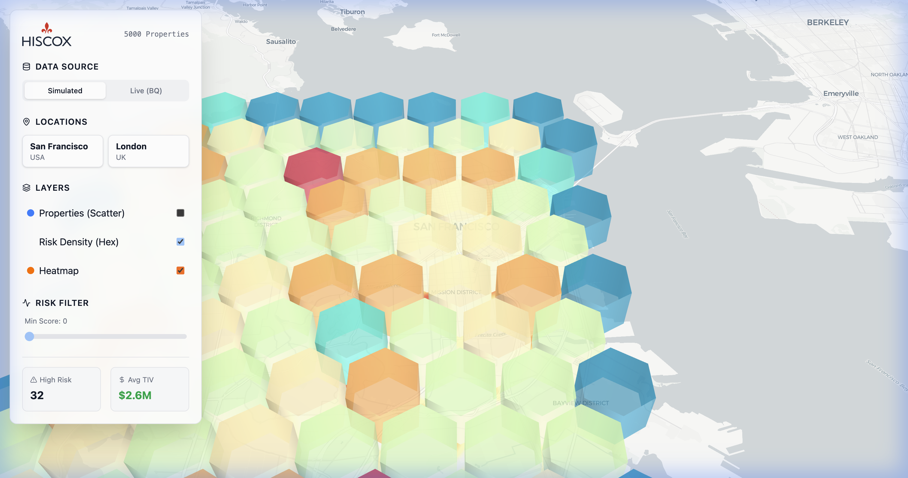

# Hiscox Risk Explorer (Deck.gl Antigravity)



## Overview

**Hiscox Risk Explorer** is a high-performance geospatial visualization application designed to analyze property risks (Flood, Fire, Wind, Theft) across major cities (San Francisco, London). 

It leverages **Deck.gl** for rendering thousands of data points and aggregated hexagon layers over **MapLibre GL** basemaps, providing a smooth, interactive experience. The backend is powered by **FastAPI** and **Google BigQuery**, capable of handling large-scale datasets, though the application includes a comprehensive **Mock Data** mode for offline development.

## Features

- **Interactive Layers**: 
  - **Scatterplot**: Individual property risks with hover tooltips.
  - **Hexagon Layer**: Aggregated visual density of high-risk areas.
  - **Heatmap**: INTENSITY visualization of risk scores.
- **Dynamic Filtering**: Filter properties by Risk Score.
- **Multi-City Support**: Seamless fly-to transitions between San Francisco and London.
- **Resilient Data Loading**: Automatically falls back to client-side mock data generation if the backend is unreachable.

## Technology Stack

- **Frontend**: React 19, Vite, Tailwind CSS v4
- **Visualization**: Deck.gl v9, MapLibre GL, D3 Scale
- **Backend**: Python 3.11, FastAPI
- **Database**: Google BigQuery
- **Infrastructure**: Docker, Google Cloud Run

## Demo


---

## 🚀 Getting Started

### Prerequisites

- **Node.js**: v18+
- **Python**: v3.11+ (for backend)
- **Google Cloud Project** (Optional, for production data)

### Installation

1. **Clone the repository**:
   ```bash
   git clone <repository_url>
   cd deckgl-antigravity
   ```

2. **Install Frontend Dependencies**:
   ```bash
   npm install
   ```

3. **Install Backend Dependencies** (Optional for local dev):
   ```bash
   pip install -r backend/requirements.txt
   ```

---

## 🛠️ Running Locally

### Option 1: Frontend Only (Mock Data Mode)
The easiest way to explore the UI. The app will attempt to connect to the backend, fail, and automatically switch to "Simulated" mode using client-side generated data.

```bash
npm run dev
```
Open [http://localhost:5173](http://localhost:5173).

### Option 2: Full Stack (with BigQuery)
Requires Google Cloud credentials.

1. **Set up BigQuery Data**:
   ```bash
   # Generates mock data and uploads to your BigQuery project
   python scripts/setup_bigquery.py --project_id YOUR_PROJECT_ID --truncate
   ```

2. **Run Backend**:
   ```bash
   export GOOGLE_CLOUD_PROJECT=YOUR_PROJECT_ID
   uvicorn backend.main:app --reload --port 8080
   ```

3. **Run Frontend**:
   ```bash
   npm run dev
   ```

---

## ☁️ Deployment Service

The application is containerized using Docker and designed for **Google Cloud Run**.

### Build & Deploy

A utility script `deploy.sh` is provided to streamline deployment.

1. **Permissions**: Ensure you have a GCP Service Account with `BigQuery Data Viewer` and `BigQuery Job User` roles.

2. **Run Deployment Script**:
   ```bash
   # Usage: ./deploy.sh <PROJECT_ID>
   ./deploy.sh my-gcp-project-id
   ```

   **What this does:**
   - Grants necessary IAM roles to the Cloud Run service account.
   - Builds the Docker image (Frontend build + Python environment).
   - Submits the build to Google Container Registry (GCR).
   - Deploys the service to Cloud Run (publicly accessible by default).

### Docker Structure
The `Dockerfile` employs a **multi-stage build**:
1. **Build Stage**: Uses `node:22-alpine` to compile the React frontend.
2. **Runtime Stage**: Uses `python:3.11-slim`, installs FastAPI dependencies, copies the built frontend assets, and serves the API. The FastAPI app serves the static frontend files on the root `/` path.

## Project Structure

```
deckgl-antigravity/
├── backend/                # Python FastAPI backend
│   └── main.py             # API endpoints and static file serving
├── scripts/                # Data generation and setup scripts
│   └── setup_bigquery.py   # Populates BigQuery with mock data
├── src/                    # React Frontend
│   ├── components/         # Deck.gl map and UI components
│   ├── data/               # Client-side mock data generators
│   └── App.jsx             # Main application logic
├── deploy.sh               # Cloud Run deployment script
├── Dockerfile              # Multi-stage Docker build
└── vite.config.js          # Vite configuration (proxy setup)
```
